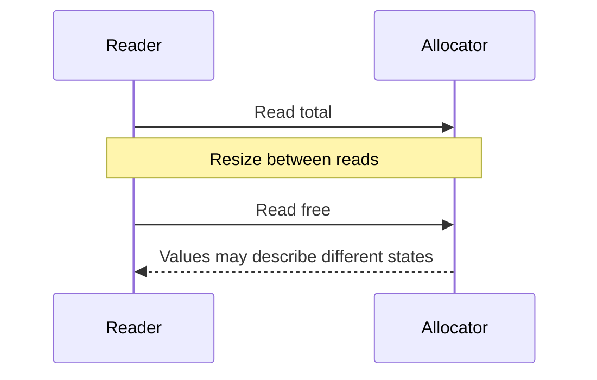
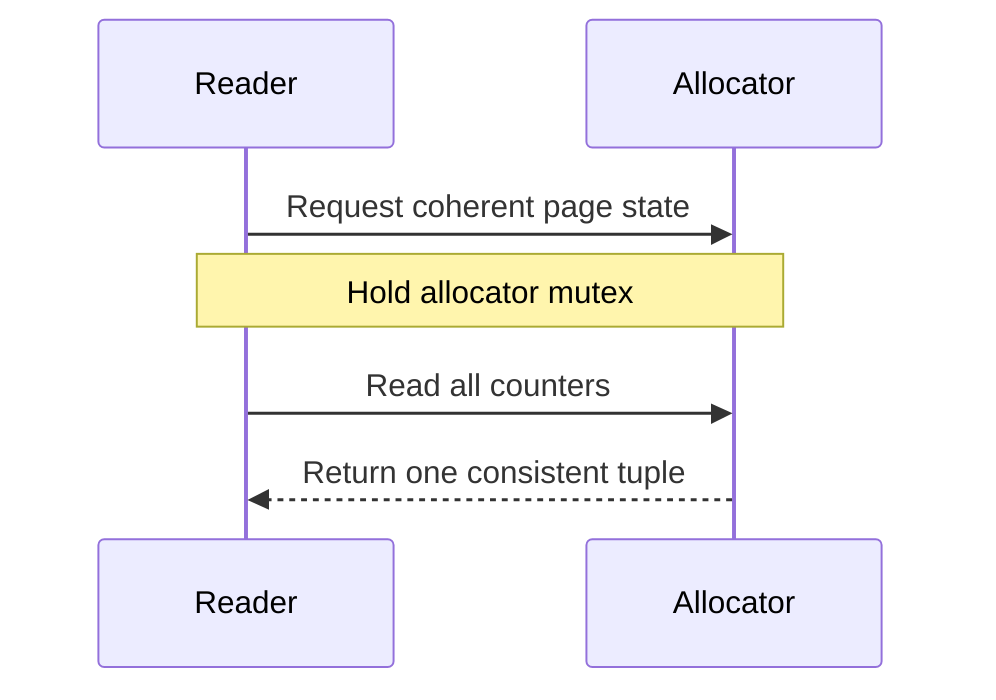

## The problem: individually readable values are not a coherent state

Allocation, release and resize update counters while monitoring reads them. Protecting writes with the allocator mutex did not protect unsynchronized plain-integer readers from C++ data races. Separately, even safe individual reads can combine total and free from different states.



## The fix: separate two read contracts

Hot single-counter readers use relaxed atomics without waiting for the allocator mutex. Observers that need a coherent total/free/in-use/reserved tuple call get_page_state(), which reads the complete state inside one critical section. Neither mechanism replaces the other.



```cpp
int64_t PageAllocator::get_num_free_pages() const {
  return num_free_pages_.load(std::memory_order_relaxed);
}

PageState PageAllocator::get_page_state() const {
  std::lock_guard<std::mutex> lock(lock_);
  return get_page_state_unlocked();
}
```

[Source at the merged revision](https://github.com/ovg-project/kvcached/blob/d40c4ce8aa761f809e4d6d2d57d30ce8a295000a/csrc/page_allocator.cpp#L443-L476)

## Why not lock everything or make everything atomic?

A mutex on every getter addresses data races but makes frequent readers wait for allocator writes. Atomic fields alone do not turn several loads into a transaction. Relaxed ordering protects counter accesses; it is not a publication protocol for GPU mapping completion.

## Validation and limits

The PR reports three-run medians on T4 with Qwen2.5-3B, C64/N256 and I512/O128: 2501.87 total tok/s for the unsynchronized baseline, 2458.83 for mutex-protected hot getters, and 2504.00 for atomic getters plus a locked snapshot. These are workload-specific observations, not universal speedups. Validation also included 1000 concurrent shrink/expand cycles, 10 focused tests and 121 CPU tests.

## Pitfalls

_unlocked means the caller already holds the required lock; it does not mean the helper just released it. Internal helpers avoid reacquiring a non-recursive mutex. A Python manager lock is not the C++ allocator mutex. A difference between two atomic loads is still not a coherent snapshot during resize.

[PR #443](https://github.com/ovg-project/kvcached/pull/443)
