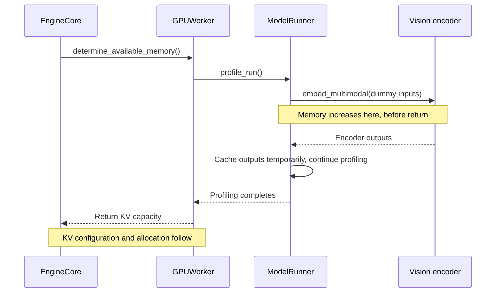
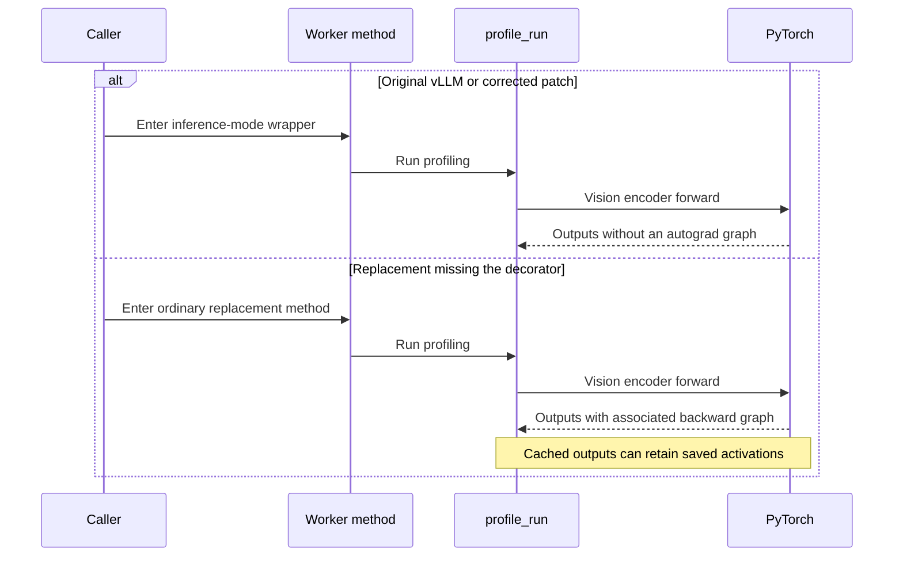

## One process reached 14 GiB before serving a request

The essential fix was one line: `@torch.inference_mode()`. Omitting it did not merely distort an estimate. It added more than ten GiB of real startup memory consumption and could push an otherwise viable deployment into CUDA OOM.

The regression came from [KVCached #448](https://github.com/ovg-project/kvcached/pull/448), which I worked on. That change addressed shared-GPU profiling: device-wide memory changes caused by other processes could be charged to the current instance. It replaced `GPUWorker.determine_available_memory()` and retained the required model profiling, but missed the original method's decorator.

Small text-model validation did not expose the omission. With a multimodal model, one vision-encoder profiling forward changed the process footprint from roughly 2.9 GiB to 14.06 GiB. This was **physical memory consumption**, not a larger virtual KV capacity. Whether 14 GiB itself causes OOM depends on GPU capacity and existing occupancy; the regression was the unnecessary increase within one process.

[#461](https://github.com/ovg-project/kvcached/pull/461) restored that line. I acknowledged the omission and validation gap in the PR. The investigation is more instructive than the patch size.

## Locate the increase before explaining it

An initially plausible explanation was that a larger KV budget had enlarged the hybrid model's Mamba cache. Before/after startup screenshots alone would not distinguish that from activation memory.

Phase-level measurements did. The increase happened inside `model.embed_multimodal()`, called from `determine_available_memory()`. The worker method had not returned. KV cache configuration, block-count calculation and KV tensor allocation had not executed.



An allocation that has not happened cannot explain the current peak. This excludes eager Mamba/KV allocation as the cause of this increase, not every possible hybrid-cache issue.

The next comparison held the image, model, arguments and profiling inputs constant, changing only `patches.py`. Both paths used the V1 runner, `pixel_values` with shape `(65536, 1536)` and dtype `bfloat16`, and `image_grid_thw` with shape `(1, 3)`. Multimodal budgets and item counts matched. The old path was not quietly profiling smaller images.

The public [#460 report](https://github.com/ovg-project/kvcached/issues/460) records:

| Measurement            |   Before #448 |       With #448 |
| ---------------------- | ------------: | --------------: |
| Allocated before embed |     0.867 GiB |       0.867 GiB |
| Allocated after embed  |     0.944 GiB |       13.13 GiB |
| PyTorch peak           |     1.943 GiB |       13.62 GiB |
| Process footprint      | About 2.9 GiB | About 14.06 GiB |

The paths entered the same forward with almost identical allocation and left with radically different allocation. The question was now **what changed in the execution context of that call**, not page size or logical KV capacity.

These columns are not interchangeable. Allocated memory belongs to live PyTorch tensors; reserved memory is held by its allocator; peak is a high-water mark over a measurement interval. The driver's process footprint includes other allocations too. Do not add them together or attribute an entire cumulative peak to one function. The matched before/after allocated measurements provide the stronger localization evidence.

## The missing behavior was above the function body

In vLLM 0.22.1, the worker enters inference mode at the method boundary. This excerpt shows that boundary and one profiling branch, with other logic omitted:

```python
@torch.inference_mode()
def determine_available_memory(self) -> int:
    # ...
    if kv_cache_memory_bytes := self.cache_config.kv_cache_memory_bytes:
        # still need a profile run which compiles the model for
        # max_num_batched_tokens
        self.model_runner.profile_run()
        # ...
```

See [gpu_worker.py, lines 357–373](https://github.com/vllm-project/vllm/blob/v0.22.1/vllm/v1/worker/gpu_worker.py#L357-L373). The regular budget branch calls `profile_run()` at [lines 392–400](https://github.com/vllm-project/vllm/blob/v0.22.1/vllm/v1/worker/gpu_worker.py#L392-L400), under the same decorator.

The V1 runner's `profile_run()` has no independent inference-mode decorator. It relies on its caller. The relevant flow, shortened within the same method, is:

```python
def profile_run(self) -> None:
    # Profile with multimodal encoder & encoder cache.
    if self.supports_mm_inputs:
        # ... build multimodal dummy inputs ...
        dummy_encoder_outputs = self.model.embed_multimodal(
            **batched_dummy_mm_inputs
        )
        # ... validate outputs ...
        for i, output in enumerate(dummy_encoder_outputs):
            self.encoder_cache[f"tmp_{i}"] = output
```

The complete code is in [gpu_model_runner.py, lines 6104–6161](https://github.com/vllm-project/vllm/blob/v0.22.1/vllm/v1/worker/gpu_model_runner.py#L6104-L6161). Notice the last two lines: outputs are retained temporarily rather than discarded immediately after forward.

With autograd enabled and gradient-requiring parameters involved, PyTorch builds a backward graph and saves intermediate tensors needed for a possible backward pass. An inference-only intention is not enough: the runtime needs the appropriate execution mode. Keeping an output alive can also keep its graph and saved activations alive.

The weights and image sizes had not grown. The forward was carrying backward-pass state that inference did not need. This accounts for high allocated memory persisting after the call returned.



Replacing a class method does not inherit its decorators. The decorator wrapped the original function object; assigning a different function bypasses that wrapper. Matching the name, signature and return value does not preserve execution context.

## Why eval and empty_cache were not the fix

`model.eval()` changes training/evaluation behavior in modules such as Dropout and BatchNorm. It does not disable autograd. `torch.no_grad()` disables gradient recording, but the direct repair here was to preserve upstream's existing `inference_mode()` contract. The [PyTorch inference-mode documentation](https://docs.pytorch.org/docs/stable/generated/torch.autograd.grad_mode.inference_mode.html) explicitly distinguishes inference mode from model evaluation mode.

`empty_cache()` cannot release memory still referenced by live tensors and graphs. Reducing dummy-image size or skipping multimodal profiling might make startup fit, but would hide the changed execution mode and weaken initialization checks.

The repair belongs at the missing context boundary, not in a workaround that avoids the affected workload.

## Restore the line, then test inside the call

The [merged #461 source](https://github.com/ovg-project/kvcached/blob/60cad949389af6bbf1d65c4eddf325113df5a9eb/kvcached/integration/vllm/patches.py#L2058-L2069) decorates the replacement. Only the body is omitted below:

```python
@torch.inference_mode()
def _patched_determine_available_memory(
    self, *args: Any, **kwargs: Any
) -> int:
    ...
```

The model forward still runs. Model and CUDA Graph profiling remain, the logical KV-capacity formula is unchanged, and real CUDA errors still propagate.

Checking only the returned capacity cannot detect this omission. Regression tests inspect these conditions while `profile_run()` and `profile_cudagraph_memory()` execute, not after the outer call returns:

```python
assert torch.is_grad_enabled() is False
assert torch.is_inference_mode_enabled() is True
```

The [regression tests](https://github.com/ovg-project/kvcached/blob/60cad949389af6bbf1d65c4eddf325113df5a9eb/tests/test_vllm_virtual_kv_capacity.py) protect the execution mode. The PR also records CPU tests across Python 3.9–3.13, C++ tests, typing checks and pre-commit. The real-device A/B establishes that the omission caused substantial memory regression; unit tests guard against recurrence. CPU tests do not replace multimodal GPU validation.

## A practical starting point for the next memory spike

Keep image, model, configuration and inputs fixed while changing one patch or revision. Mark startup boundaries: weight loading, model profiling, multimodal encoder, CUDA Graph and KV tensor allocation. Do not infer the entire cause from the final OOM message.

This is an illustrative temporary diagnostic, **not a reconstruction of the original tracing code or something to leave in a production benchmark**:

```python
def trace_memory(stage: str, device: torch.device) -> None:
    # Explicit device matters in multi-GPU processes.
    # Synchronization makes this diagnostic intrusive; remove for benchmarks.
    torch.cuda.synchronize(device)
    gib = 1024**3
    print(
        stage,
        {
            "allocated_gib": torch.cuda.memory_allocated(device) / gib,
            "reserved_gib": torch.cuda.memory_reserved(device) / gib,
            "peak_gib": torch.cuda.max_memory_allocated(device) / gib,
            "grad_enabled": torch.is_grad_enabled(),
            "inference_mode": torch.is_inference_mode_enabled(),
        },
        flush=True,
    )

trace_memory("before_embed_multimodal", device)
outputs = model.embed_multimodal(**dummy_inputs)
trace_memory("after_embed_multimodal", device)
```

Record where peak measurement starts. Resetting peak statistics inside an existing profiling routine can corrupt its budget calculation. Compare input shapes, dtypes, item counts and budgets as well as memory. Inspect output tensors' `requires_grad` and `grad_fn` when useful, without retaining extra output references just for logging.

If the cause remains unclear, use PyTorch profiler memory recording or allocator snapshots within the narrowed window. They add overhead and cannot alone account for all non-PyTorch allocations, so start with phase boundaries rather than full-service tracing.

What worked here was the sequence: exclude allocations that had not executed, isolate the forward with identical-input A/B, then inspect the context supplied by its caller. The fix was short. Finding it required looking beyond the replacement's body at what the original method had guaranteed to everything it called.
