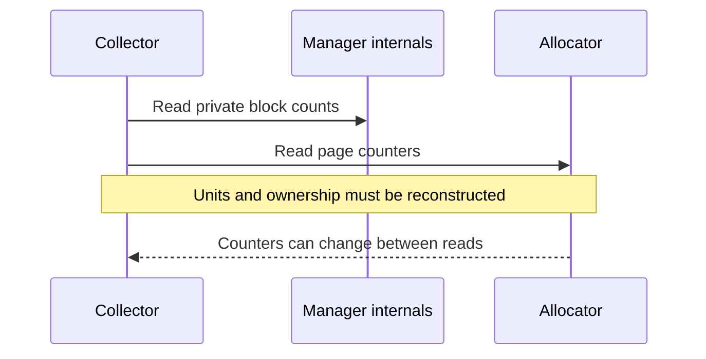
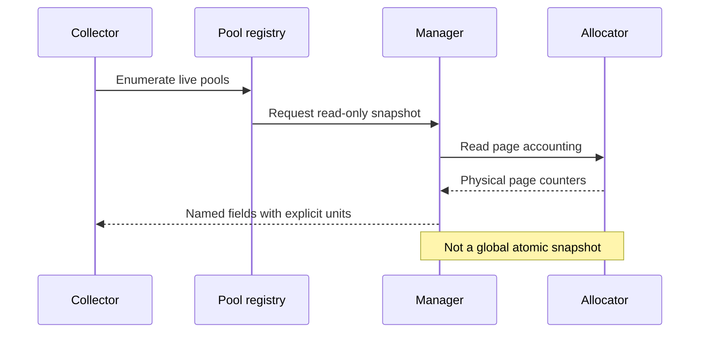

## The problem: a capacity number needs a definition

Elastic KV pools expose logical blocks, virtual address capacity, mapped physical pages and reserved capacity. Subtracting used from total does not necessarily describe GPU memory occupancy. Reading private fields also couples collectors to implementation details.

This PR establishes a read-only interface with explicit units and pool identity. It is neither a quota scheduler nor a Prometheus server.

## Before: every collector reconstructs pool state



A mem_size may describe one buffer in one layer, not the entire pool. Ignoring layer count or separate K/V buffers changes the meaning of the result. Reserved blocks and reserved pages are another pair of distinct concepts.

## After: discover live pools and request named snapshots



A weak-reference registry discovers pools without extending their lifetime. Collectors choose their own polling frequency, transport and presentation. The same entry point supports vLLM and SGLang integration.

Effective free pages cannot exceed logical free pages:

```python
free_pages = _call_int(allocator, "get_num_free_pages")
reserved_pages = _call_int(allocator, "get_num_reserved_pages")
available_physical_pages = _call_int(allocator, "get_avail_physical_pages")
if free_pages is None or reserved_pages is None or available_physical_pages is None:
    effective_free_pages = None
else:
    effective_free_pages = min(free_pages, available_physical_pages + reserved_pages)
```

[Effective free pages, lines 166–173](https://github.com/ovg-project/kvcached/blob/c85bac20e5ccb04766f995512abbff0dfbca1055/kvcached/observability.py#L166-L173)

Unavailable allocator capabilities remain None. Unknown must not silently become zero and look like exhausted capacity.

## Units and overlapping quantities

```python
virtual_bytes_per_buffer = _int_attr(manager, "mem_size") or 0
virtual_per_layer_bytes = virtual_bytes_per_buffer * num_kv_buffers
block_size_bytes = _int_attr(manager, "block_mem_size") or 0
bytes_per_block = block_size_bytes * num_layers * num_kv_buffers
```

[Unit conversion, lines 183–186](https://github.com/ovg-project/kvcached/blob/c85bac20e5ccb04766f995512abbff0dfbca1055/kvcached/observability.py#L183-L186)

| Quantity            | Meaning                                           | Important limit                                    |
| ------------------- | ------------------------------------------------- | -------------------------------------------------- |
| Virtual total bytes | Virtual capacity across layers and buffers        | Not physical GPU occupancy                         |
| Mapped bytes        | Mapped physical storage                           | Not all processes' GPU memory                      |
| Allocated blocks    | Allocation accounting including reserved blocks   | Do not add reserved blocks again                   |
| Available blocks    | Allocatable capacity, including reusable reserves | Not necessarily disjoint from allocated accounting |
| Reserved pages      | Physical page reserves                            | Not block-level reserves                           |

These fields answer different questions. Adding them arbitrarily does not produce a meaningful total.

## Snapshot consistency

The manager snapshot entry can use manager synchronization, but a Python manager lock does not automatically serialize a C++ background preallocation thread. Multiple counter reads at this merged revision must not be presented as a globally atomic snapshot.

Explicit accounting is a foundation for subsequent concurrency improvements, not proof that every writer already shares a lock.

## Validation and operational pitfalls

[PR #385](https://github.com/ovg-project/kvcached/pull/385) records CPU tests and a real CUDA VMM pool test on RTX 4090. Allocated blocks followed 1 → 33 → 1, and allocated bytes 512 → 16896 → 512. Virtual total capacity was 33554432 bytes and mapped capacity 8388608 bytes. These numbers describe that test pool, not a general model configuration.

- Collection must not silently grow or trim a pool.
- Choose a polling frequency appropriate to query cost.
- Distinguish unsupported fields from undiscovered pools and stale deployed code.
- Later atomic-counter improvements are not retroactive properties of this PR.
