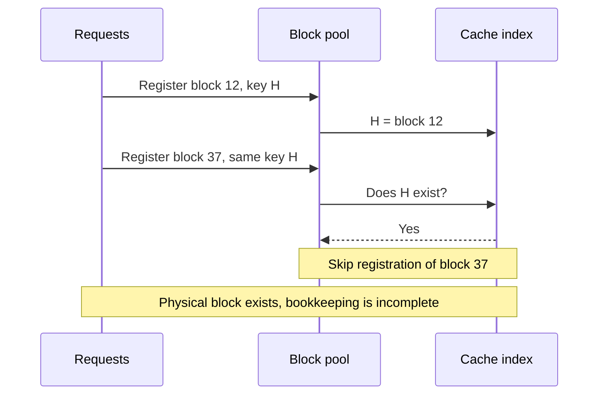
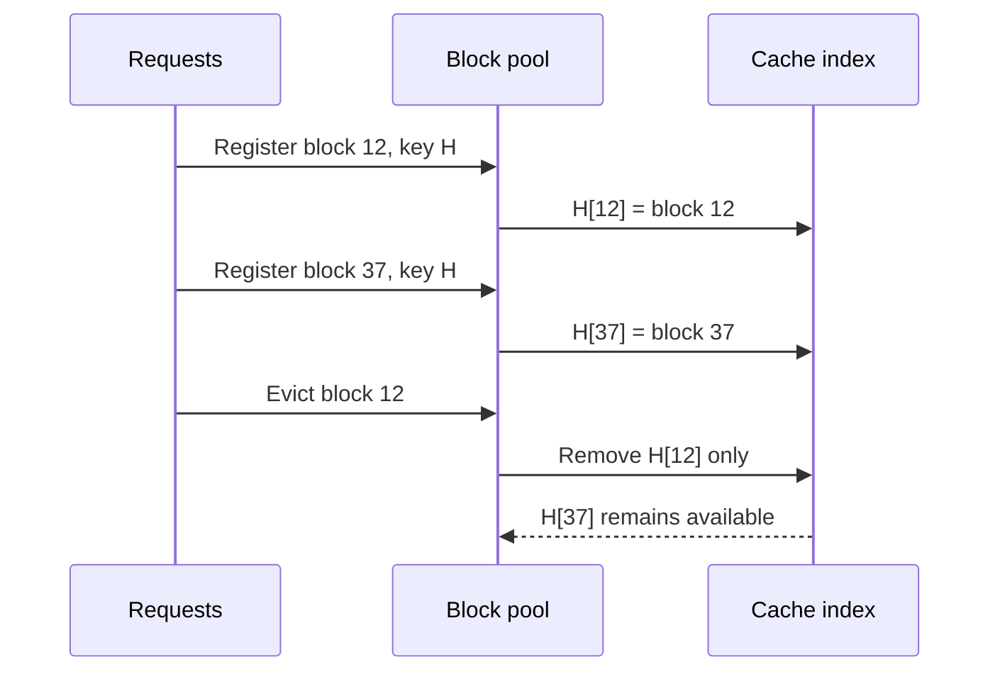

## The problem: equal content is not equal identity

A cache key identifies reusable content and its cache group. A block ID identifies a particular storage block. Multiple existing blocks can have the same key. The old index treated a repeated key as a repeated registration and skipped the second block.

This fix does not allocate extra copies to improve the hit rate. It keeps existing copies accounted for. H, 12 and 37 below are illustrative identifiers, not a captured trace.

## Before: registration stops at an existing key



The old idempotency check was:

```python
# Already cached, idempotent
if key in self._cached_blocks:
    continue
```

That continue also skipped hash stamping and reverse-index registration. A hybrid-cache consumer may require every newly cached block to have a non-null block_hash, making the omission a correctness problem, not merely a missed cache hit.

The condition is that distinct blocks reach registration under the same key. It does not mean that any pair of identical prompts always crashes.

## After: look up by content, remove by identity



The outer dictionary remains content-addressed. The inner dictionary tracks physical block IDs. A reverse index maps each block ID back to its key. Lookup still returns one reusable block:

```python
def _get_one_cached_block(self, key: Any) -> Optional[KVCacheBlock]:
    blocks = self._cached_blocks.get(key)
    if not blocks:
        return None
    return next(iter(blocks.values()))
```

[Lookup at the merged revision, lines 458–462](https://github.com/ovg-project/kvcached/blob/fc26d25b584841545ca1794057223f417ef5a4ae/kvcached/integration/vllm/patches.py#L458-L462)

next(iter(...)) returns a KVCacheBlock, not an iterator or a list. The single-group and multi-group interfaces have different return contracts.

Removal targets one copy:

```python
def _remove_cached_block(
    self, key: Any, block_id: int
) -> Optional[KVCacheBlock]:
    blocks = self._cached_blocks.get(key)
    if not blocks:
        return None
    block = blocks.pop(block_id, None)
    if not blocks:
        self._cached_blocks.pop(key, None)
    return block
```

[Removal, lines 464–473](https://github.com/ovg-project/kvcached/blob/fc26d25b584841545ca1794057223f417ef5a4ae/kvcached/integration/vllm/patches.py#L464-L473)

The outer key disappears only when its last copy is gone. Registration also removes a reused block ID from its previous key before updating both indexes. [Registration, lines 574–581](https://github.com/ovg-project/kvcached/blob/fc26d25b584841545ca1794057223f417ef5a4ae/kvcached/integration/vllm/patches.py#L574-L581)

## Why reference counting and locking are different concerns

A reference count answers how many users hold a particular block. The cache index answers which blocks represent particular content. Valid reference counts cannot make a single-value dictionary represent multiple copies.

Registering block 12 and then block 37 sequentially still triggers the old skip. A read/write lock around registration cannot fix that representation.

Preventing duplicate computation or storage upstream would require a separate design for waiting requests, publishing completed computation, failure recovery and writable state. This bookkeeping fix neither implements nor rules out that optimization.

## Pitfalls

- Preserve cache-group identity; a raw token hash is not always the full key.
- Re-registering the same block is idempotent; a different block with the same content is not.
- Evicting one copy must not discard its siblings.
- The index does not replace reference counts or the distinction between idle and in-use blocks.
- Do not describe this as eliminating redundant prefill.

## Validation and limits

[PR #402](https://github.com/ovg-project/kvcached/pull/402) records regression coverage and 1440/1440 completed requests in a two-instance prefix-reuse validation without the relevant hash assertion or EngineCore failure. These are historical PR results, not tests executed by this website.

Source links are pinned to the merged revision. Newer framework contracts need their own verification.
