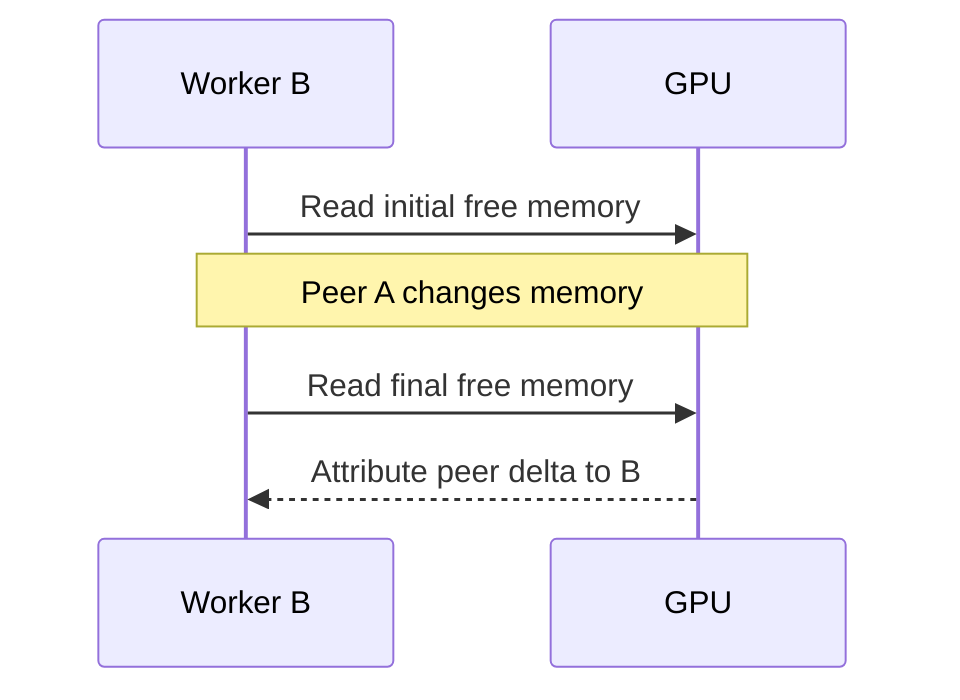
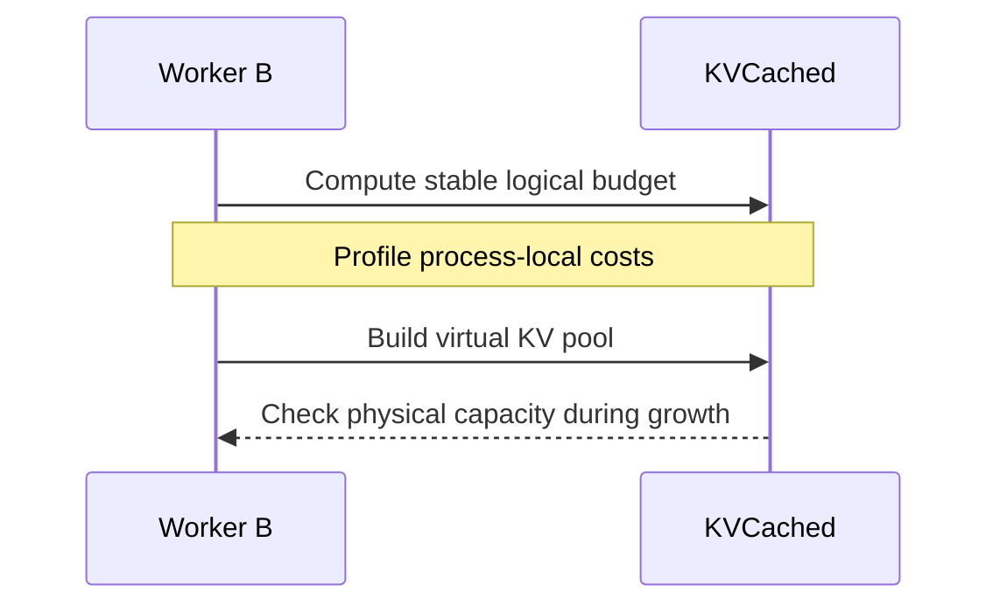

## The problem: a peer's memory growth becomes your estimated cost

vLLM profiles non-KV costs using device-wide free-memory observations and process-local PyTorch counters. Another instance loading weights, growing KV mappings or releasing memory can contaminate the difference. A public report recorded free memory rising from 8.57 GiB to 12.91 GiB during profiling and triggering a startup assertion.



## The fix: separate logical capacity from physical admission

With KVCached enabled, establish a stable budget from total memory and utilization, then deduct local weights and the Torch peak increase. Keep required model profiling and supported CUDA Graph profiling without using peer-driven memory deltas for logical KV sizing. Explicit kv_cache_memory_bytes and disabled-KVCached behavior retain their contracts.



```python
# Simplified capacity formula, not the full worker method.
available_memory = (
    virtual_budget
    - weights_memory
    - torch_peak_increase
)
```

[Source at the merged revision](https://github.com/ovg-project/kvcached/blob/f8bbb005ed5c1eb9285e2e8f2afa7fc83b8da052/kvcached/integration/vllm/patches.py#L2071-L2126)

## Why a startup lock is insufficient

After A releases its startup lock, it starts serving and changing memory use. B can hold the same lock while A continues allocating. Starting C later has the same problem. Serializing initializers cannot make device-wide counters process-local; pausing every serving peer would affect live traffic.

## Validation and limits

The PR records T4 startup and OK responses with vLLM 0.24.0 and SGLang 0.5.15. CUDA Graph was disabled in that SGLang smoke test, so it does not establish graph-capture coverage. The SGLang path reduces rank-local capacity with MIN to preserve common geometry; any rank-query failure coordinates fallback to avoid divergent collectives.

## Pitfalls

Virtual capacity is not free physical memory and cannot make an infeasible deployment fit. Weights, graphs, communication and physical KV pages still consume memory. Null-block reservation may wait indefinitely when no page becomes available. This PR also omitted inference_mode and introduced a multimodal profiling regression, subsequently fixed in #461. That coverage gap is part of the engineering record.

[PR #448](https://github.com/ovg-project/kvcached/pull/448)
