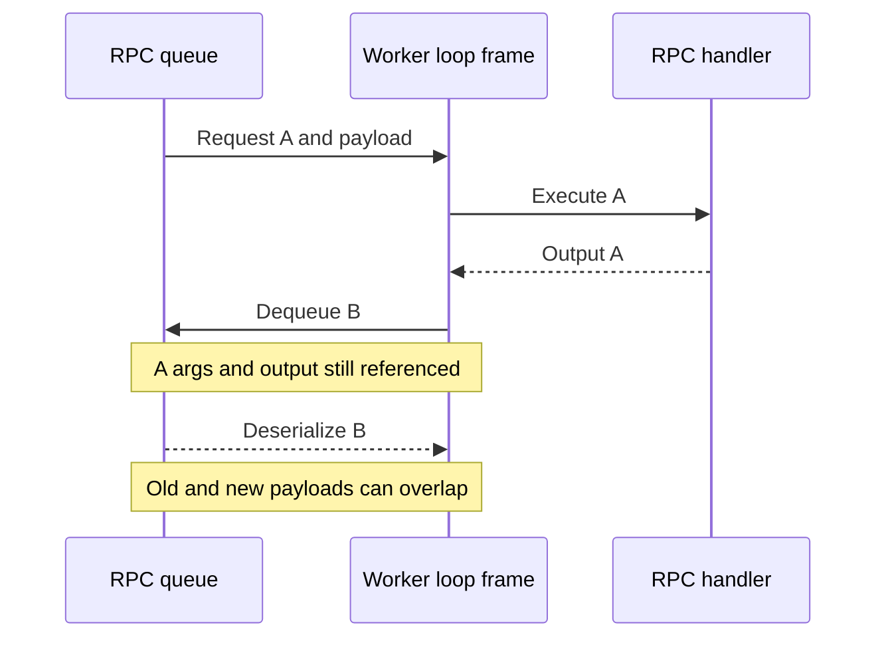
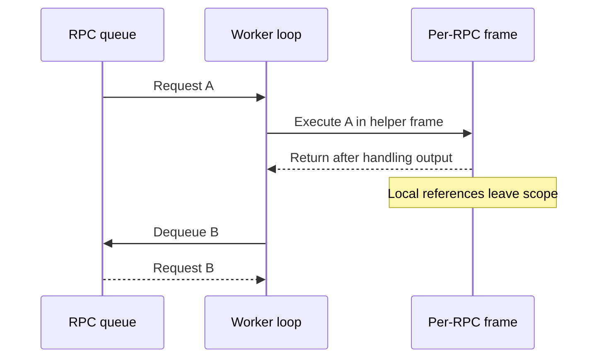

## The problem: a completed call can retain its payload

The worker's long-running RPC loop originally held method, args, kwargs and output in one persistent frame. Finishing the handler did not remove those local references.

When the next request deserialized a large payload such as CPU tensors, the previous request's objects could still be alive. This is an unnecessary lifetime overlap, not necessarily an unbounded memory leak.

## Before: dequeue first, replace old locals afterward



The assignment in the old loop had this shape:

```python
method, args, kwargs, output_rank = self.rpc_broadcast_mq.dequeue(
    indefinite=True
)
```

Python evaluates the right-hand side before replacing the left-hand variables. The previous args therefore remain referenced during dequeue. A deserialized callable held in func can introduce another indirect reference; deleting just one variable is insufficient.

## After: one frame per RPC



The loop delegates execution:

```python
def worker_busy_loop(self):
    """Main busy loop for Multiprocessing Workers"""
    assert self.rpc_broadcast_mq is not None
    while True:
        self._execute_worker_rpc(self.rpc_broadcast_mq.dequeue(indefinite=True))
```

[Worker loop, lines 1029–1033](https://github.com/vllm-project/vllm/blob/4ca856b0b59d87c7b167d1bd8c748421719c9a57/vllm/v1/executor/multiproc_executor.py#L1029-L1033)

The helper unpacks the tuple, resolves the method, executes it and handles its output within a separate frame. After normal return, the persistent loop no longer owns those locals; only then does it dequeue again.

[Per-RPC execution, from line 1035](https://github.com/vllm-project/vllm/blob/4ca856b0b59d87c7b167d1bd8c748421719c9a57/vllm/v1/executor/multiproc_executor.py#L1035)

The transport, queue and serialization protocol are unchanged. The fix narrows how long the consumer retains objects.

## Why not call the garbage collector each time?

Reachable objects are not garbage. gc.collect() cannot replace removing live references, and collecting globally on a frequent RPC path can add pauses. Frame scope addresses the lifetime boundary directly.

Moving the handler must preserve output-rank filtering and exception response behavior. Those are protocol contracts, not incidental details.

## Proving lifetime rather than watching RSS

The regression test uses weak references to check whether the previous payload is still alive when the next dequeue begins. This tests ownership directly. Allocators may keep freed storage for reuse, so process RSS need not immediately fall.

The helper does not release objects deliberately retained elsewhere by the worker. Persistent caches and exception references still require their own lifetime analysis.

## Performance evidence and limits

The historical T4 A/B in [PR #51979](https://github.com/vllm-project/vllm/pull/51979) transplanted the method-level change into vLLM 0.18.0 with a small MoE test model, TP1, eager execution, 64 requests and I64/O32:

| Version | Two-run mean throughput |
| ------- | ----------------------- |
| Before  | 118.215 tok/s           |
| After   | 118.222 tok/s           |

The approximately 0.006% difference is not a meaningful speedup. It supports no observable throughput regression for that workload only. Tests against the submitted code and performance measurements of an older-version transplant are distinct evidence.

The contribution is a cleaner payload lifetime, not a throughput claim.
