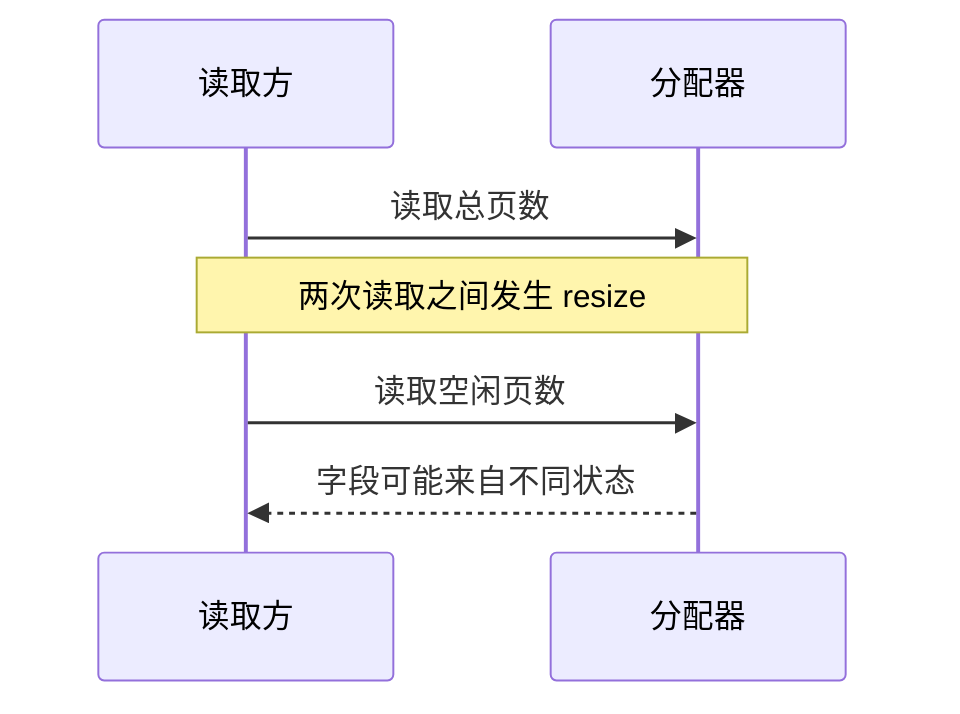
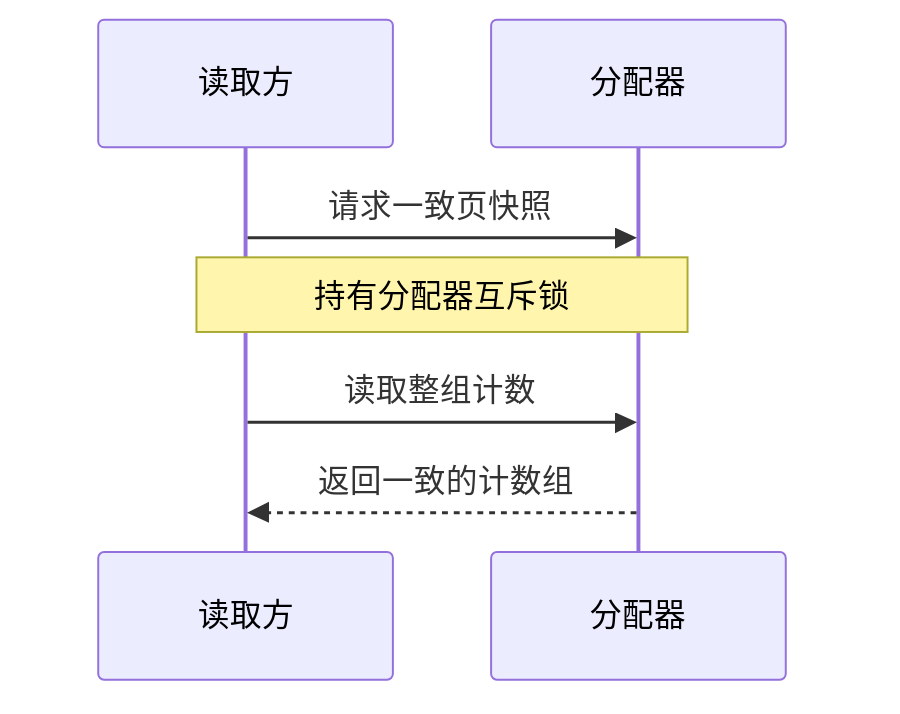

## 问题：每个数都能读，不代表读到的是同一个状态

后台分配、释放和 resize 会更新页计数器，监控又会同时读取它们。原来的写入虽然受 allocator mutex 保护，但不拿同一把锁的普通整数读取仍可能产生 C++ 数据竞争。另一层问题是，即使每个字段都能安全读取，先读 total、后读 free，也可能拼出不属于任何一个瞬间的组合。



## 修复：把两种读取需求分开

调度侧只需要一个计数时，用 relaxed atomic 保证单字段读取没有数据竞争，不为每次查询等待 allocator mutex。监控需要 total/free/in-use/reserved 的一致组合时，调用 get_page_state()，在同一临界区读完整组状态。原子计数不替代快照锁，快照锁也不要求所有单字段查询都走粗锁。



```cpp
int64_t PageAllocator::get_num_free_pages() const {
  return num_free_pages_.load(std::memory_order_relaxed);
}

PageState PageAllocator::get_page_state() const {
  std::lock_guard<std::mutex> lock(lock_);
  return get_page_state_unlocked();
}
```

[合入版本源码](https://github.com/ovg-project/kvcached/blob/d40c4ce8aa761f809e4d6d2d57d30ce8a295000a/csrc/page_allocator.cpp#L443-L476)

## 为什么不能简单地全部上锁或全部原子化

所有 getter 上锁也能解决数据竞争，但会让频繁读取等待分配器写操作。反过来，把所有字段都换成 atomic 并不会让多个 load 自动成为事务。这里 relaxed 只保护计数读取，不用于发布映射完成状态或证明 GPU 工作已经结束。

## 验证与边界

PR 记录了 T4、Qwen2.5-3B、C64/N256、I512/O128 的三轮中位数：无同步基线 2501.87 total tok/s；高频 getter 加 mutex 为 2458.83；原子读取加快照锁为 2504.00。不能把这组差值推广成所有负载下的固定收益。另有 1000 次缩容/扩容并发快照检查、10 项针对性测试及 121 项 CPU 测试。

## 容易踩的坑

_unlocked 表示调用方已经持有必要的锁，不是“刚刚解锁”。内部 helper 避免再次获取非递归 mutex。Python 管理器锁和 C++ allocator 锁不是同一把锁；两次 atomic load 的差值也不保证一致，在 resize 并发下需要快照接口。

[PR #443](https://github.com/ovg-project/kvcached/pull/443)
