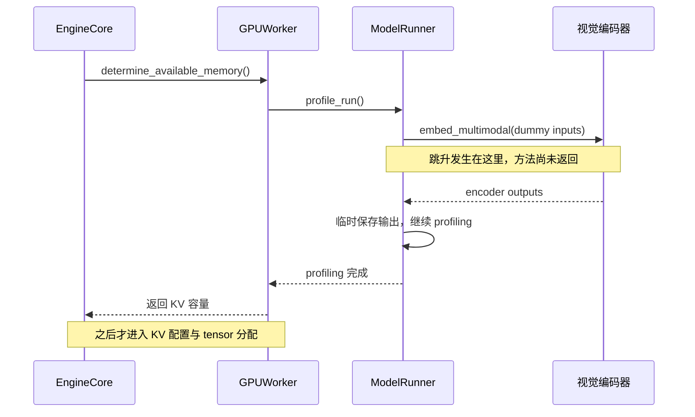
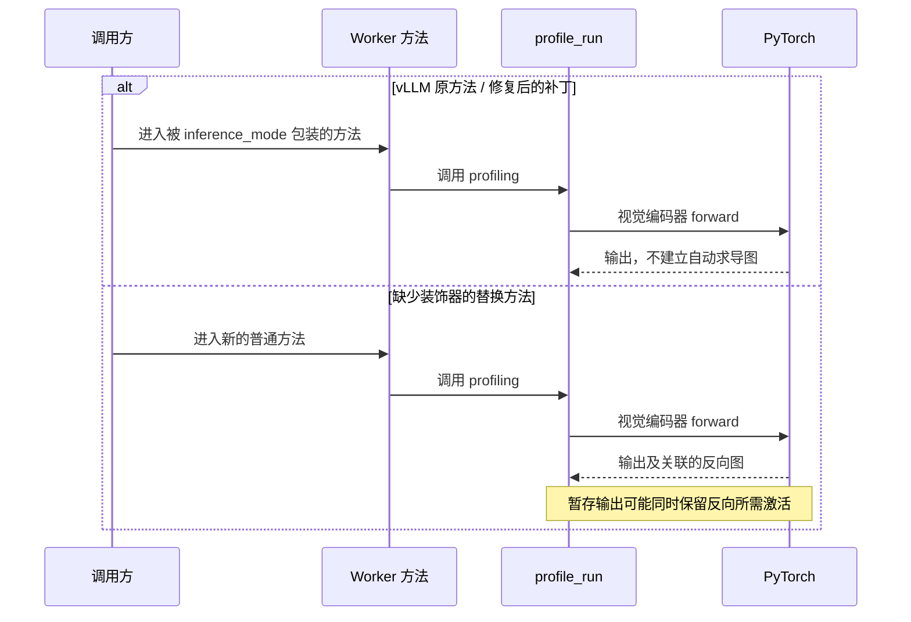

## 服务还没接请求，一个进程先涨到了 14 GiB

这次修复的核心只有一行：`@torch.inference_mode()`。漏掉它的后果，却不是容量统计偏一点，而是启动期间真的多占了十几 GiB 显存，足以把原本能启动的服务推到 CUDA OOM。

问题来自我参与的 [KVCached #448](https://github.com/ovg-project/kvcached/pull/448)。它解决的是同卡多实例启动时，vLLM 把其他进程的显存变化算进本实例预算的问题。为此，补丁替换了 `GPUWorker.determine_available_memory()`，保留了必要的模型 profiling，却漏掉了原方法上的推理模式装饰器。

小文本模型的验证没有暴露这件事。换到多模态模型，视觉编码器启动画像的一次 forward 就让单个进程从原路径约 2.9 GiB 变成了约 14.06 GiB。这里说的是**真实显存占用**，不是给 KV Cache 宣告了一个更大的虚拟容量。14 GiB 是否直接 OOM 取决于卡的容量和已有占用；回归在于同一个进程平白多出了这笔开销。

最终的 [#461](https://github.com/ovg-project/kvcached/pull/461) 恢复了这一行。我也在 PR 中说明了遗漏和验证缺口。比补丁本身更值得记录的，是怎样从“新版本显存暴涨”一步步缩小到这行代码。

## 先把峰值钉在一次 forward 里

刚看到新版本显存变大时，一个合理的怀疑是：补丁放大了可用 KV 预算，混合模型是不是顺带创建了更大的 Mamba cache？如果只看启动前后两张显存截图，很容易沿着这个方向继续查。

但首先要回答的是：**显存在哪一步涨起来的？** 分阶段记录把跳升定位到了 `determine_available_memory()` 内部的 `model.embed_multimodal()`。此时方法还没返回，后面的 KV cache 配置、block 数量计算和 tensor 分配都没有执行。



尚未执行的 Mamba/KV 分配，不可能解释眼前这次峰值。这不证明混合缓存永远没有其他问题，只排除了本次跳升的一个候选原因。

随后做同输入 A/B：镜像、模型、启动参数保持不变，只换 `patches.py`。两边都是 V1 runner，`pixel_values` 的 shape 为 `(65536, 1536)`、dtype 为 `bfloat16`；`image_grid_thw` 的 shape 为 `(1, 3)`，多模态预算和 item 数也一致。旧路径没有偷偷缩小图片。

公开在 [#460](https://github.com/ovg-project/kvcached/issues/460) 的阶段数据如下：

| 观察位置             |  #448 之前 | 带 #448 的路径 |
| -------------------- | ---------: | -------------: |
| embed 前的 allocated |  0.867 GiB |      0.867 GiB |
| embed 后的 allocated |  0.944 GiB |      13.13 GiB |
| PyTorch 峰值         |  1.943 GiB |      13.62 GiB |
| 进程显存占用         | 约 2.9 GiB |   约 14.06 GiB |

进入同一个 forward 前，两边几乎完全相同；返回后，差距已经出现。调查重点就不该再是 page size 或逻辑 KV 容量，而是**相同输入经过这次调用时，执行环境有什么不同**。

读这些数还要分清口径。`allocated` 是 PyTorch 当前张量占用，`reserved` 是 allocator 保留的空间，peak 是统计区间内的高水位，驱动看到的进程占用还包含 allocator 之外的开销。它们不能相加，也不能把一次累计 peak 直接当作某个函数新申请了多少显存。本次有说服力的是相同边界的前后 allocated 对照，而不只是那个很大的 peak。

## 沿着 vLLM 往外找，差异在函数体上面

vLLM 0.22.1 的 worker 方法从入口就打开了推理模式。下面摘出入口和其中一条 profiling 调用分支，中间省略其他逻辑：

```python
@torch.inference_mode()
def determine_available_memory(self) -> int:
    # ...
    if kv_cache_memory_bytes := self.cache_config.kv_cache_memory_bytes:
        # still need a profile run which compiles the model for
        # max_num_batched_tokens
        self.model_runner.profile_run()
        # ...
```

[vLLM 0.22.1：gpu_worker.py，357–373 行](https://github.com/vllm-project/vllm/blob/v0.22.1/vllm/v1/worker/gpu_worker.py#L357-L373)。普通预算分支也在这个装饰器的作用范围内，并在 [392–400 行](https://github.com/vllm-project/vllm/blob/v0.22.1/vllm/v1/worker/gpu_worker.py#L392-L400) 调用 `profile_run()`。

再往里看，V1 `GPUModelRunner.profile_run()` 没有自己的 `@torch.inference_mode()`。它依赖外层 worker 提供上下文，而不是每个调用点都重复设置一次：

```python
def profile_run(self) -> None:
    # Profile with multimodal encoder & encoder cache.
    if self.supports_mm_inputs:
        # ... build multimodal dummy inputs ...
        dummy_encoder_outputs = self.model.embed_multimodal(
            **batched_dummy_mm_inputs
        )
        # ... validate outputs ...
        for i, output in enumerate(dummy_encoder_outputs):
            self.encoder_cache[f"tmp_{i}"] = output
```

这是同一方法的删节摘录，保留了调用关系；完整代码见 [gpu_model_runner.py，6104–6161 行](https://github.com/vllm-project/vllm/blob/v0.22.1/vllm/v1/worker/gpu_model_runner.py#L6104-L6161)。尤其值得注意最后两行：输出会暂存到 `encoder_cache`，不是 forward 一结束就全部丢弃。

如果开启自动求导，并且计算涉及需要梯度的参数，PyTorch 会建立反向图，为以后可能发生的 backward 保存所需中间张量。即使这里只想做推理，框架也不能替调用者猜测“以后绝不会反向传播”。输出仍被引用时，它关联的图和为反向计算保存的激活也可能继续存活。

所以这次并不是权重突然变大了，也不是图片变大了。**漏掉推理模式后，同一次前向计算开始携带推理根本不需要的反向计算状态。** 这解释了为什么 forward 已经结束，allocated 仍然停在十几 GiB。



替换类的方法不会自动继承原方法的装饰器。装饰器包装的是原来的函数对象；把类属性换成另一个函数，就绕过了那层包装。函数名相同、参数相同、返回值测试通过，都不代表执行上下文也相同。

## 为什么 eval、empty_cache 都不是这里的修复

`model.eval()` 主要改变 Dropout、BatchNorm 等模块的训练/评估行为，不会自动关闭求导。`torch.no_grad()` 可以关闭梯度记录，但这里更直接的修复是保留上游原本的 `inference_mode()` 契约，而不是擅自换一套执行语义。[PyTorch 的 inference_mode 文档](https://docs.pytorch.org/docs/stable/generated/torch.autograd.grad_mode.inference_mode.html) 也明确区分了推理模式和模型评估模式。

`empty_cache()` 不能释放仍被活跃张量、反向图引用的显存。把 dummy 图片缩小、跳过多模态画像，可能暂时让启动通过，却掩盖了补丁改变执行模式的问题，也削弱了原本应该保留的初始化检查。

这次应该修的是漏掉的上下文，不是绕开产生峰值的那条业务路径。

## 补回一行，也要补上能抓住它的测试

[#461 合入代码](https://github.com/ovg-project/kvcached/blob/60cad949389af6bbf1d65c4eddf325113df5a9eb/kvcached/integration/vllm/patches.py#L2058-L2069) 在替换方法上恢复装饰器。以下仅省略方法体：

```python
@torch.inference_mode()
def _patched_determine_available_memory(
    self, *args: Any, **kwargs: Any
) -> int:
    ...
```

模型 forward 仍然执行，模型和 CUDA Graph profiling 没有被跳过；逻辑 KV 容量公式不变，真实 CUDA 错误也照常传播。

只断言返回了多少可用容量，抓不住这种回归。新增测试在 `profile_run()` 和 `profile_cudagraph_memory()` 被调用时检查下面两个条件，而不是等外层方法返回以后才检查：

```python
assert torch.is_grad_enabled() is False
assert torch.is_inference_mode_enabled() is True
```

[对应回归测试](https://github.com/ovg-project/kvcached/blob/60cad949389af6bbf1d65c4eddf325113df5a9eb/tests/test_vllm_virtual_kv_capacity.py) 验证的是调用期间的执行模式。PR 同时记录了 Python 3.9–3.13 的 CPU 测试、C++ 测试、类型检查和 pre-commit 结果。前面的实机 A/B 证明遗漏能够产生真实显存回归，单测负责让这一遗漏不再悄悄回来；不能拿 CPU 测试代替多模态实机验证。

## 下次遇到启动显存暴涨，可以先这样查

首先固定镜像、模型、参数和输入，只替换一个补丁或版本。然后沿启动调用链标记边界：权重加载、模型 profiling、多模态 encoder、CUDA Graph、KV tensor 分配。别从最后一条 OOM 直接猜整个问题。

下面是排障时可以临时加入的记录示例，**不是当时日志的原样还原，也不是建议放进正式性能热路径**：

```python
def trace_memory(stage: str, device: torch.device) -> None:
    # Explicit device matters in multi-GPU processes.
    # Synchronization makes this diagnostic intrusive; remove for benchmarks.
    torch.cuda.synchronize(device)
    gib = 1024**3
    print(
        stage,
        {
            "allocated_gib": torch.cuda.memory_allocated(device) / gib,
            "reserved_gib": torch.cuda.memory_reserved(device) / gib,
            "peak_gib": torch.cuda.max_memory_allocated(device) / gib,
            "grad_enabled": torch.is_grad_enabled(),
            "inference_mode": torch.is_inference_mode_enabled(),
        },
        flush=True,
    )

trace_memory("before_embed_multimodal", device)
outputs = model.embed_multimodal(**dummy_inputs)
trace_memory("after_embed_multimodal", device)
```

峰值统计的起点需要另行记录；不要在公共 profiling 流程里随意 reset peak，干扰原有预算计算。除了显存，比较输入的 shape、dtype、item 数和预算；必要时检查输出 tensor 的 `requires_grad`、`grad_fn`，但不要为了打日志额外长期保存输出，否则排障代码自己就可能延长张量生命周期。

如果仍无法缩小范围，再用 PyTorch profiler 的内存记录或 allocator snapshot 追踪分配。它们开销更高，也不能单独解释所有非 PyTorch 分配，适合在已锁定的短窗口里使用，而不是一开始就对整个服务开全量采集。

这次真正奏效的顺序是：先用执行时间线排除尚未发生的分配，再用同输入 A/B 锁定 forward，最后比较调用者提供的执行模式。漏掉的代码很短，但定位它需要看的不只是新函数体，还包括被替换方法原本替下游保证了什么。
