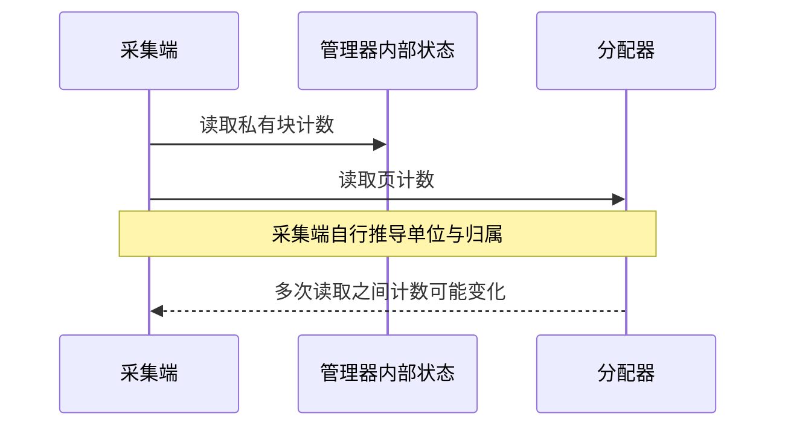
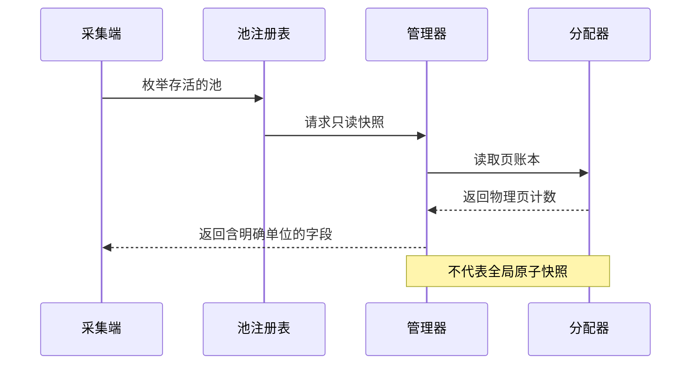

## 问题：看到容量数字，不等于知道它代表什么

弹性 KV 池同时存在逻辑 block、虚拟地址空间、已映射物理 page 和保留容量。只看“总容量减已使用”无法解释真实 GPU 占用，直接读取内部字段又把采集端绑定到了具体实现。

这项 PR 提供只读观测接口，把字段含义、单位和池身份统一起来；它不是额度调度器，也不直接搭建 Prometheus 服务。

## 旧路径：采集端自行拼接内部状态



同一个 mem_size 可能只是单层、单 buffer 的虚拟容量。如果采集端误当成整池容量，多层和 K/V 双 buffer 会把结果放大或缩小。另一个常见误区是把 reserved block 与 reserved page 当成同一概念。

## 新路径：注册池，按明确口径返回快照



弱引用注册表列出仍存活的池，不因为监控注册而延长池生命周期。采集端取得统一快照，再自行决定轮询频率、传输和展示方式。vLLM 与 SGLang 的适配层都可接入同一入口。

物理容量影响可用 page，但不能超过逻辑空闲 page：

```python
free_pages = _call_int(allocator, "get_num_free_pages")
reserved_pages = _call_int(allocator, "get_num_reserved_pages")
available_physical_pages = _call_int(allocator, "get_avail_physical_pages")
if free_pages is None or reserved_pages is None or available_physical_pages is None:
    effective_free_pages = None
else:
    effective_free_pages = min(free_pages, available_physical_pages + reserved_pages)
```

[源码：有效空闲页计算，第 166–173 行](https://github.com/ovg-project/kvcached/blob/c85bac20e5ccb04766f995512abbff0dfbca1055/kvcached/observability.py#L166-L173)

缺失的底层能力用 None 表达。不能把“未知”变成 0，否则图表会误报容量耗尽。

## 单位与字段之间的关系

```python
virtual_bytes_per_buffer = _int_attr(manager, "mem_size") or 0
virtual_per_layer_bytes = virtual_bytes_per_buffer * num_kv_buffers
block_size_bytes = _int_attr(manager, "block_mem_size") or 0
bytes_per_block = block_size_bytes * num_layers * num_kv_buffers
```

[源码：容量单位换算，第 183–186 行](https://github.com/ovg-project/kvcached/blob/c85bac20e5ccb04766f995512abbff0dfbca1055/kvcached/observability.py#L183-L186)

| 字段或概念          | 含义                                           | 不能据此推断                    |
| ------------------- | ---------------------------------------------- | ------------------------------- |
| virtual total bytes | 所有层、所有 buffer 的虚拟容量                 | 不能当作已占物理显存            |
| mapped bytes        | 已映射的物理存储量                             | 不等于所有 GPU 进程总占用       |
| allocated blocks    | 管理器分配账本，包含 reserved blocks           | 不能再无条件加一次 reserved     |
| available blocks    | 当前可分配量，也可能包含可复用 reserved blocks | 不是与 allocated 严格互斥的集合 |
| reserved pages      | 物理 page 级保留                               | 不等于 block 级保留数           |

这些字段服务于不同问题，不应随意相加生成“总量”。

## 一致性边界

快照入口可以借用管理器的同步机制，但 Python 管理器锁并不自动覆盖 C++ 后台预分配线程。因此本 PR 合入时的多个计数读取不能被描述成“整池同一瞬间的原子快照”。

这也是后续改进计数器并发安全和快照一致性的基础：先定义清楚字段，再针对写入者的同步边界改进，而不是让采集端猜测。

## 验证与使用注意

[PR #385](https://github.com/ovg-project/kvcached/pull/385) 记录了 CPU 测试和 RTX 4090 上真实 CUDA VMM 池验证。该样例分配块数为 1 → 33 → 1，对应 allocated bytes 为 512 → 16896 → 512；虚拟总量为 33554432 bytes，映射量为 8388608 bytes。这些数据属于该测试池，不是通用模型配置。

- 监控采集不应该触发扩容、缩容或调度策略。
- 采集周期需要考虑查询成本，不应为了图表刷新直接进入高频调度热路径。
- 指标缺失先区分“能力不可用”“未注册池”和“采集进程加载了旧版本”。
- 本文按合入版本解释接口，不把后续原子计数改进倒写成此 PR 已具备的能力。
