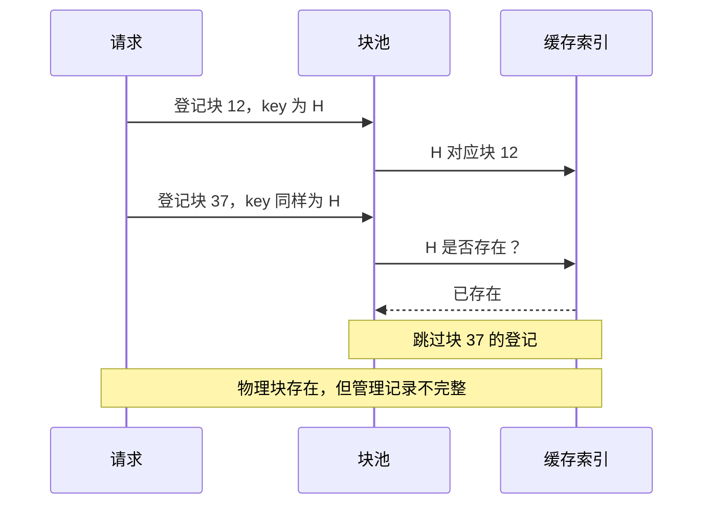
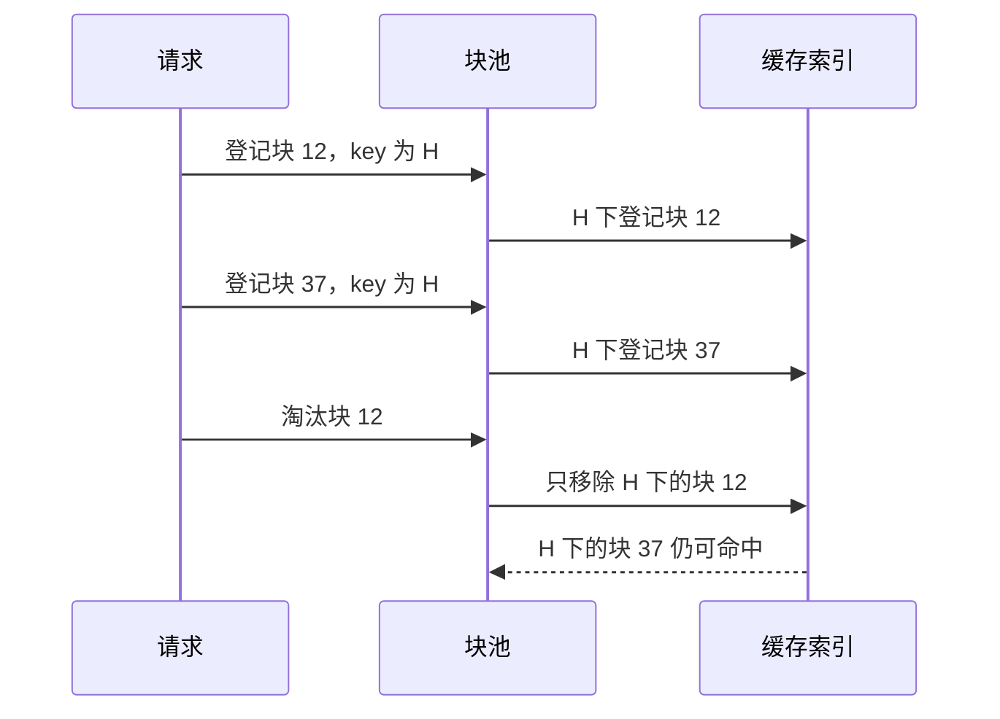

## 问题：内容相同，不代表是同一个块

前缀缓存的 key 描述可复用的内容及其缓存分组，block ID 描述一块具体的存储。同一个 key 可以对应多个已经存在的 block。KVCached 原来的单层索引把这两件事混为一谈：发现 key 已存在，就跳过后一个 block 的登记。

本次修复不是为了主动创建更多副本，也不是为了增加缓存命中率，而是保证已有物理块不会从管理记录中消失。以下以 H、12、37 举例，是执行路径示意，不是实机日志。

## 旧流程：把相同内容误当成重复登记



原实现以 key 判断幂等：

```python
# Already cached, idempotent
if key in self._cached_blocks:
    continue
```

当 block 37 与 block 12 内容相同，但不是同一物理块时，这个 continue 也跳过了后续 block_hash 写入和反向索引登记。vLLM 的混合缓存路径可能要求新缓存块具有非空 block_hash，因此问题不只是“少命中一次缓存”，还可能触发断言。

触发条件是不同块实际到达相同 key 的登记路径。不能把它简化成“任意两个相同 prompt 都必然崩溃”。

## 修复：按内容查找，按块身份登记和淘汰



外层字典仍按缓存 key 查找；内层按 block ID 保存实际副本。反向索引保留 block ID → key 的关系。缓存命中只需要从同一 key 的副本中取出一个可复用块：

```python
def _get_one_cached_block(self, key: Any) -> Optional[KVCacheBlock]:
    blocks = self._cached_blocks.get(key)
    if not blocks:
        return None
    return next(iter(blocks.values()))
```

[源码：缓存查找，合入版本第 458–462 行](https://github.com/ovg-project/kvcached/blob/fc26d25b584841545ca1794057223f417ef5a4ae/kvcached/integration/vllm/patches.py#L458-L462)

这里 next(iter(...)) 返回的是一个 KVCacheBlock，不是迭代器，也不是列表。不能为了“统一类型”直接改成 list；旧版单分组接口和新版多分组接口的返回契约不同。

淘汰则必须同时指定 key 和 block ID：

```python
def _remove_cached_block(
    self, key: Any, block_id: int
) -> Optional[KVCacheBlock]:
    blocks = self._cached_blocks.get(key)
    if not blocks:
        return None
    block = blocks.pop(block_id, None)
    if not blocks:
        self._cached_blocks.pop(key, None)
    return block
```

[源码：按块移除，第 464–473 行](https://github.com/ovg-project/kvcached/blob/fc26d25b584841545ca1794057223f417ef5a4ae/kvcached/integration/vllm/patches.py#L464-L473)

只有最后一个副本被移除，外层 key 才消失。登记时还会清理该 block ID 对应的旧 key，再完成哈希和双向索引更新：

```python
previous_key = self._block_id_to_key.get(block.block_id)
if previous_key is not None and previous_key != key:
    self._remove_cached_block(previous_key, block.block_id)
    _reset_block_hash(block)
if getattr(block, "block_hash", None) is None:
    _set_block_hash(block, key)
self._cached_blocks.setdefault(key, {})[block.block_id] = block
self._block_id_to_key[block.block_id] = key
```

[源码：登记路径，第 574–581 行](https://github.com/ovg-project/kvcached/blob/fc26d25b584841545ca1794057223f417ef5a4ae/kvcached/integration/vllm/patches.py#L574-L581)

## 为什么引用计数和读写锁不能替代这次修复

引用计数回答“这个具体块还有几个使用者”；缓存索引回答“这个内容有哪些可复用块”。二者不是同一种关系。两个块各有合法引用计数，也不代表单层字典能同时登记它们。

即使 block 12、block 37 完全串行登记，旧 continue 仍会遗漏第二个块。给这段登记代码加读写锁不能改变字典只能保留一个值的事实。

如果目标是从源头杜绝所有重复计算或存储，需要额外设计请求等待、计算完成发布、失败恢复、块复用和写时复制。这是另一项调度与存储优化，不能用一个登记锁代替，也不应把它误称为本次索引修复的前提。

## 容易踩的坑

- 不要把 key 当成纯 token hash；分组信息也是隔离不同缓存用途的一部分。
- 同一个块重复登记才是幂等，不是相同内容出现第二次就可以跳过。
- 淘汰某一副本时，不要删除同 key 的其他副本。
- 已释放、可淘汰和仍被请求引用是不同状态，双层索引不能绕过原有引用计数规则。
- 修复维护的是已有块的生命周期，不宣称消除了重复 prefill。

## 验证与边界

[PR #402](https://github.com/ovg-project/kvcached/pull/402) 记录了回归测试，以及双实例前缀复用请求 1440/1440 完成、未出现相关哈希断言或 EngineCore 失败的验证。这里引用的是 PR 的历史记录，不是此网页重新执行的测试。

源码链接固定到合入提交，便于对应当时行为；后续 vLLM 的接口变化仍需要单独检查。
