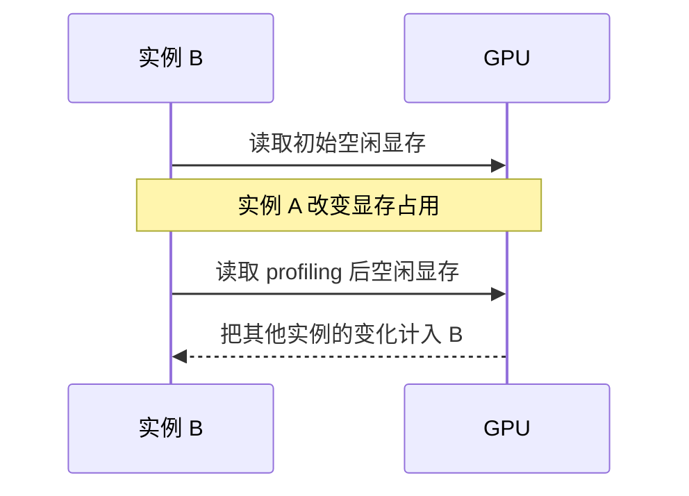
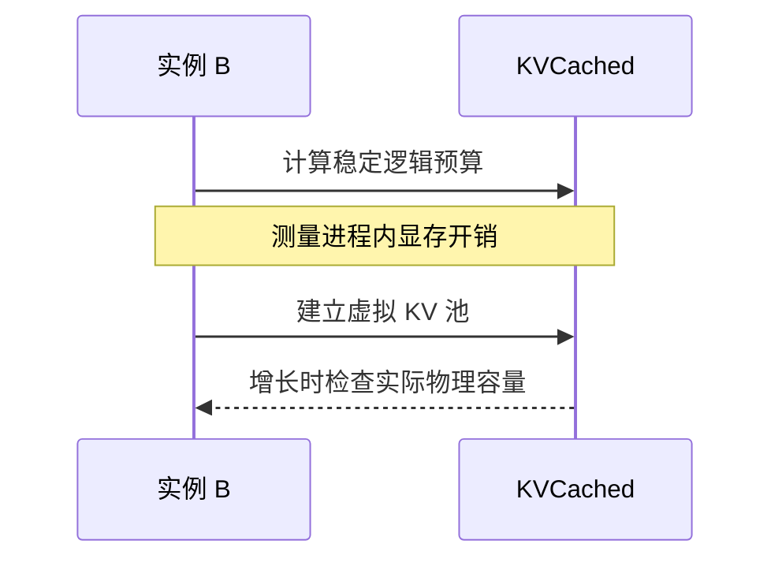

## 问题：另一实例的显存增长，被算进了自己的预算

vLLM 启动时读取整卡空闲显存，再运行 profiling 估算非 KV 开销。但 PyTorch allocator 的统计是进程内的，GPU 空闲显存是整卡的。另一实例加载权重、扩张 KV 或释放内存，会污染这个差值。公共 issue 记录过 profiling 期间空闲显存从 8.57 GiB 增至 12.91 GiB，触发初始化断言。



## 修复：逻辑容量和物理准入分开

启用 KVCached 时，以总显存乘利用率建立稳定逻辑预算，再扣除本实例权重和 Torch 峰值增量。保留必要的 profile_run 和可用的 CUDA Graph profiling，但不使用跨进程显存增减计算逻辑 KV 容量。显式 kv_cache_memory_bytes 和未启用 KVCached 的路径保持原语义。



```python
# Simplified capacity formula, not the full worker method.
available_memory = (
    virtual_budget
    - weights_memory
    - torch_peak_increase
)
```

[合入版本源码](https://github.com/ovg-project/kvcached/blob/f8bbb005ed5c1eb9285e2e8f2afa7fc83b8da052/kvcached/integration/vllm/patches.py#L2071-L2126)

## 为什么启动锁没有解决根本问题

A 完成启动、释放锁后会开始服务；B 即使随后拿锁，它 profiling 期间 A 仍可能申请或释放显存。再启动 C 时也一样。只串行初始化不能把整卡计数变成进程内计数，若暂停所有已经服务的实例，又会影响在线请求。

## 验证与边界

PR 记录了 T4 上 vLLM 0.24.0 与 SGLang 0.5.15 启动并返回 OK。SGLang 该次 smoke test 关闭了 CUDA Graph，不能扩大为完整图捕获验证。SGLang 使用 rank-local 成本并在 world group 上取 MIN，保证各 rank 的池几何一致；任一 rank 查询失败时共同走回退，避免 collective 次序分裂。

## 容易踩的坑

虚拟预算不是实际空闲显存，也不保证配置一定装得下。权重、CUDA Graph、通信和真实物理页仍消耗显存。null block 无可用页时可能一直等待，因此启动成功性还取决于物理资源。本 PR 曾遗漏 inference_mode，造成多模态 profiling 回归，后由 #461 修复；这不是可以隐藏的验证缺口。

[PR #448](https://github.com/ovg-project/kvcached/pull/448)
