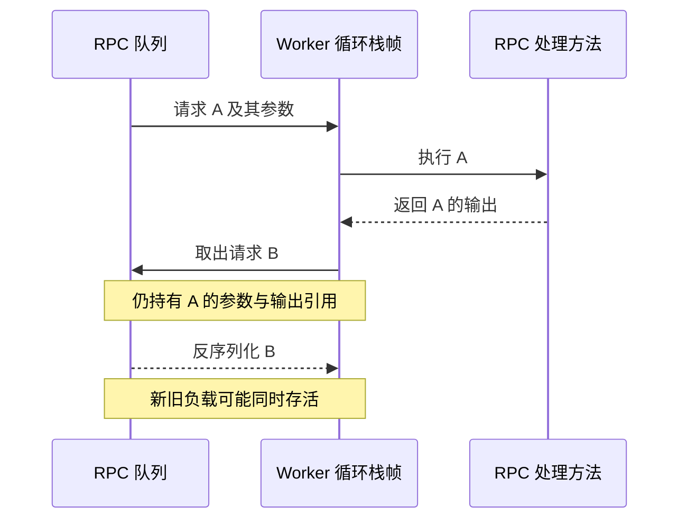
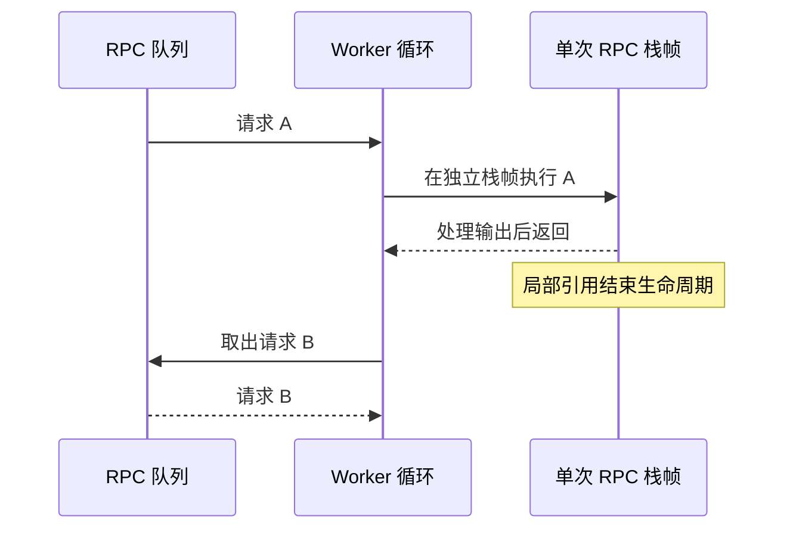

## 问题：调用结束了，参数还留在循环里

Worker 使用长期运行的循环取出 RPC、执行方法并发送结果。原实现把 method、args、kwargs 和 output 都放在这个循环的同一栈帧中。函数调用结束不等于这些局部变量已经失去引用。

当下一个 RPC 含有 CPU Tensor 等较大负载时，新负载反序列化期间，上一个 RPC 的对象可能仍然活着。问题是瞬时生命周期重叠，不应直接描述为无限增长的内存泄漏。

## 旧流程：先取下一条，才覆盖旧变量



旧循环中的赋值形态：

```python
method, args, kwargs, output_rank = self.rpc_broadcast_mq.dequeue(
    indefinite=True
)
```

Python 先执行赋值右侧，再替换左侧变量。因此 dequeue 运行时，旧 args 等变量仍引用上一批数据。如果 method 是反序列化出来的 callable，func 也可能间接保留相关对象。只删除一个参数变量不能保证清理了所有局部引用。

## 修复：用单次调用栈帧限定局部对象寿命



新循环只负责出队并把整条请求交给 helper：

```python
def worker_busy_loop(self):
    """Main busy loop for Multiprocessing Workers"""
    assert self.rpc_broadcast_mq is not None
    while True:
        self._execute_worker_rpc(self.rpc_broadcast_mq.dequeue(indefinite=True))
```

[源码：循环入口，第 1029–1033 行](https://github.com/vllm-project/vllm/blob/4ca856b0b59d87c7b167d1bd8c748421719c9a57/vllm/v1/executor/multiproc_executor.py#L1029-L1033)

_execute_worker_rpc 接收请求 tuple，在自己的栈帧里解包、解析 method、执行函数并处理输出。正常返回后，该帧的局部引用不再由循环持有，然后循环才开始下一次出队。

[源码：单次 RPC 执行入口，第 1035 行起](https://github.com/vllm-project/vllm/blob/4ca856b0b59d87c7b167d1bd8c748421719c9a57/vllm/v1/executor/multiproc_executor.py#L1035)

这不是换一种 RPC 协议，也没有重写队列的序列化策略。改动控制的是消费者栈帧持有对象的时间。

## 为什么不在每次调用后强制 GC

仍被局部变量引用的对象不是垃圾，gc.collect() 不能代替解除引用。即使可回收，在高频 RPC 上强制全局垃圾回收也可能增加停顿。独立栈帧直接处理错误的生命周期边界，不需要给每次调用增加全局回收操作。

还有两个必须保留的行为：只有指定 output rank 发送相应结果；异常仍按原来的响应路径上报。不能在移动代码时把它们漏掉。

## 怎么证明修到了，而不是碰巧 RSS 下降

回归测试使用弱引用，检查下一次 dequeue 开始时旧负载是否仍存活。它比观察某次 RSS 数值更贴近问题：即使对象引用已经释放，Python 或系统分配器也可能保留内存供后续复用，RSS 不一定立刻下降。

独立栈帧也不承诺释放被其他对象主动保存的参数。worker 自己缓存的数据、异常对象保留的引用，需要按各自生命周期分析。

## 性能验证与证据边界

[PR #51979](https://github.com/vllm-project/vllm/pull/51979) 的历史 T4 A/B 是将方法级改动移植到 vLLM 0.18.0，使用小型 MoE 测试模型、TP1、eager、64 请求、I64/O32。两轮均值为：

| 版本   | 吞吐          |
| ------ | ------------- |
| 改动前 | 118.215 tok/s |
| 改动后 | 118.222 tok/s |

约 0.006% 的差异不能当成性能提升。该数据支持这组负载下没有明显吞吐回退，但不代表所有模型和版本的性能结论。合入代码的回归测试与旧容器方法移植 A/B 也不是同一种证据。

这次贡献的价值是减少不必要的对象存活重叠，而不是宣传吞吐优化。
